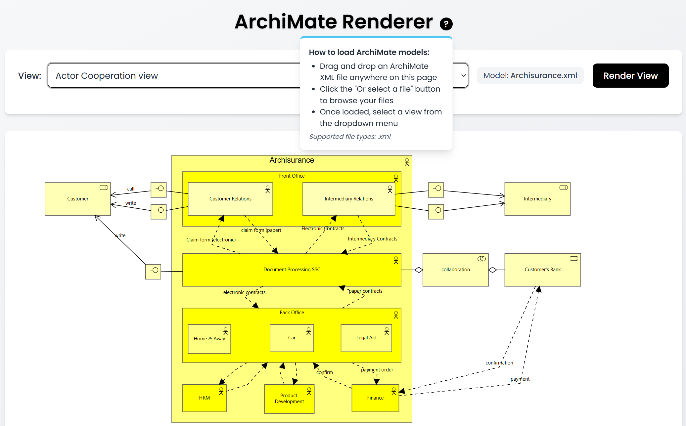

# ArchiMate Renderer
[](https://www.npmjs.com/package/archimate-renderer)
[](https://opensource.org/licenses/MIT)
[](https://www.typescriptlang.org)
[](https://nodejs.org)

A TypeScript library for rendering ArchiMate models as SVG in both Node.js and browser environments.



## Overview

ArchiMate Renderer is a lightweight TypeScript library designed to parse ArchiMate model XML files and convert them into scalable vector graphics (SVG). Its modular architecture allows for flexible integration as both a library and a command-line tool in various environments. The core functionality focuses on rendering accurate visual representations of ArchiMate models, with a clear separation between parsing logic, rendering mechanisms, and shape customization.

## Project Structure

- **src/**: Contains the main source code.
  - **cli.ts**: The command line interface entry point.
  - **index.ts**: Core rendering logic.
  - **types.ts**: Type definitions.
- **src/utils/**: Utility modules for:
  - **SVG generation and XML parsing**.
  - **Shape management**:
    - **src/utils/shapes/**: Functions for defining shapes like arrow heads, rectangles, circles, etc.
    - **src/utils/svg-shapes/**: Internal scripts for generating and mapping SVG shapes (not typically used directly).
- **docs/**: Documentation assets including screenshots.
- **examples/**: Sample ArchiMate models and HTML viewers.
- **test/**: Test cases and related assets.
- **Configuration Files**: ESLint, Prettier, and TypeScript configuration files to enforce code quality and consistency.

## Features

- Parse ArchiMate Open Exchange Format (XML)
- Render ArchiMate views as SVG
- Cross-platform compatibility (Node.js and browser)
- No dependencies on environment-specific APIs
- Fully customizable styling options
- Customizable shapes for elements and relationships
- Command line interface for batch processing

## Installation

```bash
# Install as a library
npm install archimate-renderer

# Install globally for CLI usage
npm install -g archimate-renderer
```

## Command Line Usage

The ArchiMate Renderer CLI provides commands for working with ArchiMate models from the command line.

### List Views

List all views in an ArchiMate model:

```bash
archimate-renderer list path/to/model.xml
```

### Show Model Information

Display information about an ArchiMate model:

```bash
archimate-renderer info path/to/model.xml
```

### Render a Specific View

Render a specific view from an ArchiMate model as SVG:

```bash
archimate-renderer render path/to/model.xml --view <view-id> --output output.svg
```

Options:
- `-v, --view <id>`: ID or name of the view to render
- `-o, --output <file>`: Output SVG file
- `-w, --width <width>`: SVG width in pixels (default: 1200)
- `-h, --height <height>`: SVG height in pixels (default: 800)
- `-p, --padding <padding>`: SVG padding in pixels (default: 20)
- `-f, --font-family <font>`: Font family (default: Arial, sans-serif)
- `-s, --font-size <size>`: Font size in pixels (default: 12)

### Render All Views

Render all views from an ArchiMate model as SVG files:

```bash
archimate-renderer render-all path/to/model.xml --output-dir ./output
```

Options:
- `-o, --output-dir <directory>`: Output directory for SVG files (default: ./output)
- `-w, --width <width>`: SVG width in pixels (default: 1200)
- `-h, --height <height>`: SVG height in pixels (default: 800)
- `-p, --padding <padding>`: SVG padding in pixels (default: 20)
- `-f, --font-family <font>`: Font family (default: Arial, sans-serif)
- `-s, --font-size <size>`: Font size in pixels (default: 12)

## Library Usage

### Quick Usage

```javascript
// Quick usage
import { renderArchiMateView } from 'archimate-renderer';
const svgContent = renderArchiMateView(xmlContent, { id: 'view-123' });
```

### Advanced Usage with Custom Options

```javascript
// Advanced usage with custom options
import { ArchiMateRenderer } from 'archimate-renderer';
const renderer = new ArchiMateRenderer({
  width: 1200,
  height: 800,
  padding: 30,
  fontFamily: 'Roboto, sans-serif',
  fontSize: 14,
  colors: {
    application: '#5DADE2',
    business: '#F4D03F',
    technology: '#58D68D'
  }
});
renderer.loadXml(xmlContent);
const svgContent = renderer.renderView({ id: 'view-123' });
```

### Shape Customization

```javascript
// Shape customization
import { shapeRegistry, ArchiMateElementType } from 'archimate-renderer';
shapeRegistry.registerElementShape(ArchiMateElementType.BusinessActor, customShapeFunction);
```

## Browser Usage

You can use ArchiMate Renderer directly in a browser by including the UMD bundle:

### Including via CDN

```html
<script src="https://unpkg.com/archimate-renderer/dist/umd/archimate-renderer.min.js"></script>
```

### Minimal Browser Example

```html
<!DOCTYPE html>
<html>
<head>
  <title>ArchiMate Viewer</title>
  <style>
    #diagram-container {
      width: 100%;
      height: 600px;
      border: 1px solid #ccc;
      overflow: auto;
    }
  </style>
</head>
<body>
  <div id="diagram-container"></div>
  
  <script src="https://unpkg.com/archimate-renderer/dist/umd/archimate-renderer.min.js"></script>
  <script>
    // Fetch an ArchiMate XML file
    fetch('your-archimate-model.xml')
      .then(response => response.text())
      .then(xmlContent => {
        // Create a renderer instance
        const renderer = new ArchiMateRenderer.ArchiMateRenderer();
        renderer.loadXml(xmlContent);
        
        // Get all views from the model
        const views = renderer.getViews();
        
        if (views.length > 0) {
          // Render the first view
          const svgContent = ArchiMateRenderer.renderArchiMateView(
            xmlContent,
            { id: views[0].id },
            { width: 1200, height: 800 }
          );
          
          // Display the SVG
          document.getElementById('diagram-container').innerHTML = svgContent;
        }
      })
      .catch(error => console.error('Error loading model:', error));
  </script>
</body>
</html>
```

### Global Object in Browser

When included via a script tag, the library exposes a global `ArchiMateRenderer` object with these main components:

- `ArchiMateRenderer.ArchiMateRenderer`: The main renderer class
- `ArchiMateRenderer.renderArchiMateView`: Utility function for quick rendering
- `ArchiMateRenderer.shapeRegistry`: For customizing element and relationship shapes

## Development

To build and work on the project locally:

```bash
npm install
npm run build
```

To run the CLI locally:

```bash
node dist/cli.js
```

To execute tests:

```bash
npm test
```

## Core Components

### ArchiMateRenderer Class
- Main class for converting ArchiMate XML to SVG.
- Methods:
  - `loadXml(xmlContent)`: Parses ArchiMate XML.
  - `renderView(viewIdentifier)`: Renders a specific view as SVG.
- Handles parsing of elements, relationships, and views.

### Shape Registry
- Manages registration of custom shapes for elements and relationships.
- Supports:
  - Element shapes (rectangles, ellipses, etc.).
  - Arrow heads for relationships.
  - Line styles for connections.

### Types
- `ArchiMateElementType`: Enum of all element types (Business, Application, Technology layers).
- `ArchiMateRelationshipType`: Enum of relationship types (Composition, Aggregation, etc.).
- `ArchiMateElement`, `ArchiMateRelationship`, `ArchiMateView`: Core data structures.

## License

MIT
